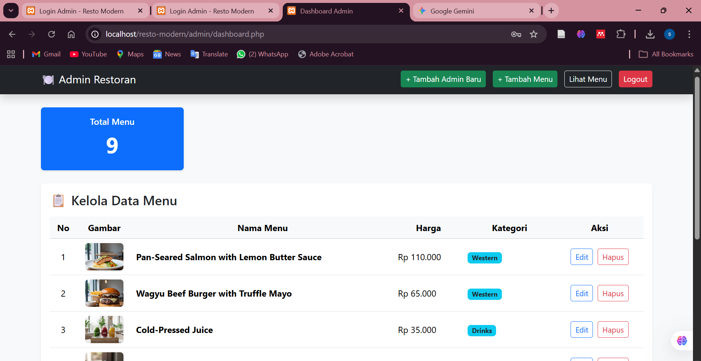
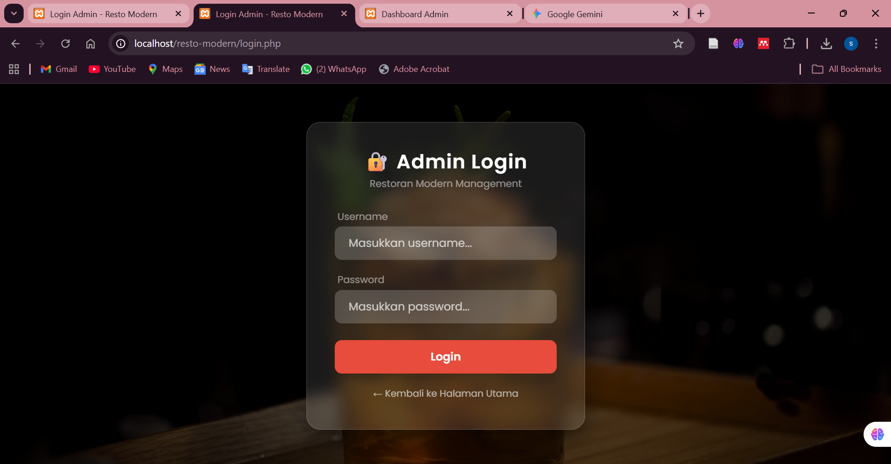

# 🍴 Website Manajemen Restoran

Website ini adalah aplikasi manajemen restoran sederhana yang mencakup fitur **CRUD** (Create, Read, Update, Delete) untuk mengelola data menu.

## 🚀 Fitur Utama
- **Tampilan Dashboard:** Desain antarmuka yang modern dan responsif.
- **Manajemen Data (CRUD):** Tambah, lihat, ubah, dan hapus data menu restoran.
- **Integrasi Database:** Penyimpanan data menggunakan MySQL.
- **Upload Gambar:** Fitur untuk mengunggah foto menu makanan/minuman.

## 🛠️ Teknologi yang Digunakan
- **Frontend:** HTML5, CSS3, JavaScript (dan Bootstrap jika ada).
- **Backend:** PHP (Native).
- **Database:** MySQL / MariaDB.
- **Server Lokal:** XAMPP / Laragon.

## 📸 Tampilan Website

### Dashboard

### Halaman Menu

### Halaman Login

